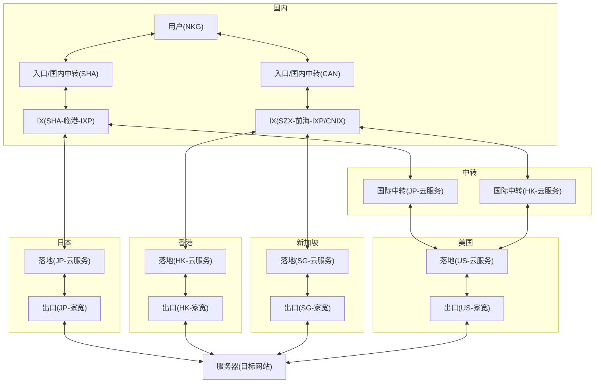

```mermaid
flowchart TD
    user["用户(NKG)"]

    entry_SHA["入口/国内中转(SHA)"]
    entry_CAN["入口/国内中转(CAN)"]

    ix_SHA["IX(SHA-临港-IXP)"]
    ix_SZX["IX(SZX-前海-IXP/CNIX)"]

    tx_JP["国际中转(JP-云服务)"]
    tx_HK["国际中转(HK-云服务)"]

    land_JP["落地(JP-云服务)"]
    land_HK["落地(HK-云服务)"]
    land_SG["落地(SG-云服务)"]
    land_US["落地(US-云服务)"]

    exit_JP["出口(JP-家宽)"]
    exit_HK["出口(HK-家宽)"]
    exit_SG["出口(SG-家宽)"]
    exit_US["出口(US-家宽)"]

    target["服务器(目标网站)"]

    subgraph 国内
        user <--> entry_SHA <--> ix_SHA
        user <--> entry_CAN <--> ix_SZX
    end

    subgraph 日本
        ix_SHA <--> land_JP
        land_JP <--> exit_JP
    end
        
    subgraph 香港
        ix_SZX <--> land_HK
        land_HK <--> exit_HK
    end
        
    subgraph 新加坡
        ix_SZX <--> land_SG
        land_SG <--> exit_SG
    end

    subgraph 中转
        ix_SHA <--> tx_JP
        ix_SZX <--> tx_HK
    end

    tx_JP <--> land_US
    tx_HK <--> land_US

    subgraph 美国
        land_US <--> exit_US
    end

    exit_JP <--> target
    exit_HK <--> target
    exit_SG <--> target
    exit_US <--> target
```
